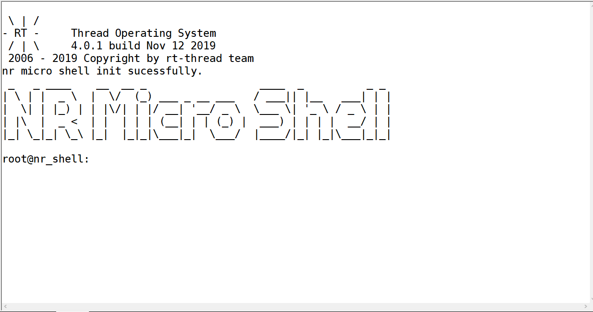

# nr_micro_shell

[中文版本](./readme.md)

> v1.0.2

## 1 Introduction

In debugging and maintenance, it is often necessary to interact with the MCU to obtain, set parameters or perform some operations, **nr_micro_shell** is a basic command-line tool written for MCU with less resources to meet this demand. Although a powerful **finsh** command-line interaction tool has been provided in the RT_Thread component. However, for a MCU with less ROM and RAM resources, **finsh** is still too large. If you want to retain use a command-line tool on these platforms, **nr_micro_shell** may be a good choice.

**nr_micro_shell** has the following advantages

1. Less resources, simple use, flexibility and convenience. Only two functions, ***shell_init()*** and ***shell()*** , are involved in the use process. It is convenient to use this tool without additional coding work on a MCU with RTOS or a bare MCU.

2. Good interaction experience. It is exactly similar to the Linux shell command line. When the serial port terminal supports ANSI (such as hypertrm terminal), it not only supports the basic command line interaction, but also provides the function of tab command completion, query history command, and direction key moving cursor modification.

3. Good expansibility. **nr_micro_shell** provides users with standard function prototypes of custom commands. When you want difine your own command, just write command functions and register command functions.

Comparison of resources occupied by **nr_micro_shell** and **finsh** (finsh does not use MSH) under the same configuration.

|    | Original project | Increase after adding nr_micro_shell | Increase after adding finsh
|--- | ----- | ------------------- | ----------
|ROM | 63660 | +3832               | +26908
|RAM | 4696  | +1104               | +1304

the configuration:

- Up to 3 historical commands.
- Support Tab completion.
- The maximum length of the command line is 100.
- Up to 10 command parameters.
- The command line thread stack is 512 bytes.

the demonstration of nr_micro_shell




### 1.1 File structure

Name       | Describation
-------- | --------------------------------------------------------------------------------------------
docs     | Document directory, including GIF pictures for demonstration, etc
examples | Example directory, including command function examples: **_nr_micro_shell_commands.c_** and use examples under rt_thread **_nr_micro_shell_thread.c_**.
inc      | Header directory.
src      | Source code directory.

### 1.2 Licence

nr_micro_shell package follows MIT license. Please refer to the 'license' file for details.

### 1.3 Dependence

None

## 2、Using nr_micro_shell package under RT_Thread with ENV

You need to select nr_micro_shell package from rt_thread package manager. The specific path is as follows:

```
RT-Thread online packages
    tools packages ---> 
        [*] nr_micro_shell:Lightweight command line interaction tool. --->
```


After pressing the 'sapce' key to select the relevant settings, press' Enter 'to configure the relevant parameters. Then let the package manager of rt_thread update automatically, or use the 'Pkgs --update' command to update the package to BSP.

If you need to run the samples, please ensure that the 'using console for kt_printf.' option in rt_thread configuration is turned on, kt_printf can work normally, and the 'use components automatically initialization.' option is turned on. nr_micro_shell can be used for direct download or simulation. When the command line is blank, press tab to display all supported commands. For the test sample command, see the use gifs under doc/pic. For the customized command process, please refer to the method in the following **3 Using nr_micro_shell package without RTOS**.

## 3 Using nr_micro_shell package without RTOS

### 3.1 Configure:

All configuration work can be done in the ***nr_micro_shell_config.h***. For details, see the comments in the file.

### 3.2 Usage:

- Make sure all files have been added into your project.

- Make sure the Macro function 'shell_printf()，ansi_show_char()' can be used in your project.

- An example is given as follow

```c
#include "nr_micro_shell.h"

int main(void)
{
    /* Initialization */
    shell_init();

    while(1)
    {
        if(USART GET A CHAR 'c')
        {
            /* nr_micro_shell receives characters. */
            shell(c);
        }
    }
}
```

Before using hardware input directly, it is recommended to use the following code (ensure that information can be printed normally) to verify whether nr_micro_shell can work.
```c
#include "nr_micro_shell.h"

int main(void)
{
    unsigned int i = 0;
    /* NR_SHELL_END_OF_LINE 0 */
    char test_line[] = "test 1 2 3\n"
    /* Initialization */
    shell_init();

    /* test */
    for(i = 0; i < sizeof(test_line)-1; i++)
    {
        shell(test_line[i]);
    }

    while(1)
    {
        if(USART GET A CHAR 'c')
        {
            /* nr_micro_shell接收字符 */
            shell(c);
        }
    }
}
```


### 3.3 Add your own command

**STEP1**:

You should realize a command function in ***nr_micro_shell_commands.c***. The prototype of the command function is as follow

```c
void your_command_funtion(char argc, char *argv)
{
    .....
}
```

**argc** is the number of parameters. **argv** stores the starting address and content of each parameter. If your input string is

```c
test -a 1
```

then the **argc** will be 3 and the content of **argv** will be

```c
-------------------------------------------------------------
0x03|0x08|0x0b|'t'|'e'|'s'|'t'|'\0'|'-'|'a'|'\0'|'1'|'\0'|
-------------------------------------------------------------
```

If you want to know the content of first or second parameter, you should use

```c
/* "-a" */
printf(argv[argv[1]])
/* "1" */
printf(argv[argv[2]])
```

**STEP2**: 

You need to register commands before using them. There are two ways to register commands.

1. When NR_SHELL_USING_EXPORT_CMD is not defined in the configuration file, register you command in the table **static_cmd[]** as follow

```c
const static_cmd_st static_cmd[] =
{
   .....
   {"your_command_name",your_command_funtion},
   .....
   {"\0",NULL}
};
```

***Attention: DO NOT DELETE {"\0",NULL} !***

2. When NR_SHELL_USING_EXPORT_CMD is defined in the configuration file and NR_SHELL_CMD_EXPORT() supports the compiler used, you can register the command as follow

```c
NR_SHELL_CMD_EXPORT(your_command_name,your_command_funtion);
```

## 4、Using nr_micro_shell simulator under linux
在工程`./examples/simulator/`目录下存放着nr_micro_shell仿真代码，仍在`./examples/nr_micro_shell_commands.c`文件中按上述方式添加自定义命令，添加完成后可以使用make命令编译源码，生产的可执行文件为`./examples/simulator/out/nr_micro_shell`或`./examples/simulator/out/nr_micro_shell_db`。可使用的make命令如下

The code of nr_micro_shell simulator is stored in the directory `./examples/simulator/`, you can add your own command in `./examples/nr_micro_shell_commands.c` as described above. After adding, you can use the `make` command to compile the source code. The produced executable is `./examples/simulator/out/nr_micro_shell` or `./examples/simulator/out/nr_micro_shell_db`。 The make commands available are as follows
```sh
# compile executable file
make
# compile gdb file
make debug
# clean files
make clean
```

## 5 Attention

Use NR_SHELL_USING_EXPORT_CMD to select the command registration method according to your usage habits.

When using static_cmd[], ensure that a registry exists in your project

```c
const static_cmd_st static_cmd[] =
{
   .....
   {"\0",NULL}
};
```

When using NR_SHELL_CMD_EXPORT(), make sure that NR_SHELL_CMD_EXPORT() supports the compiler used, otherwise an error will be reported.

ESC key not supported.

## 6 Contact

- Maintainer：Nrusher
- Homepage：<https://github.com/Nrusher/nr_micro_shell> or <https://gitee.com/nrush/nr_micro_shell>
